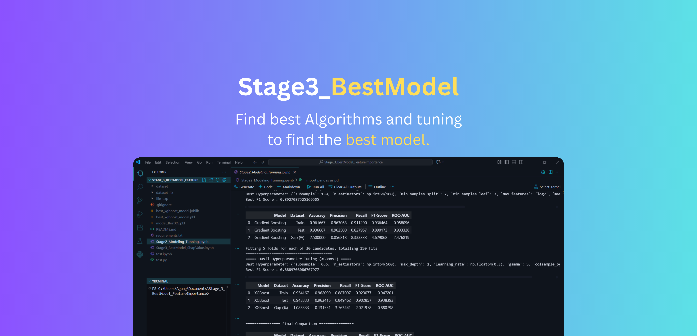
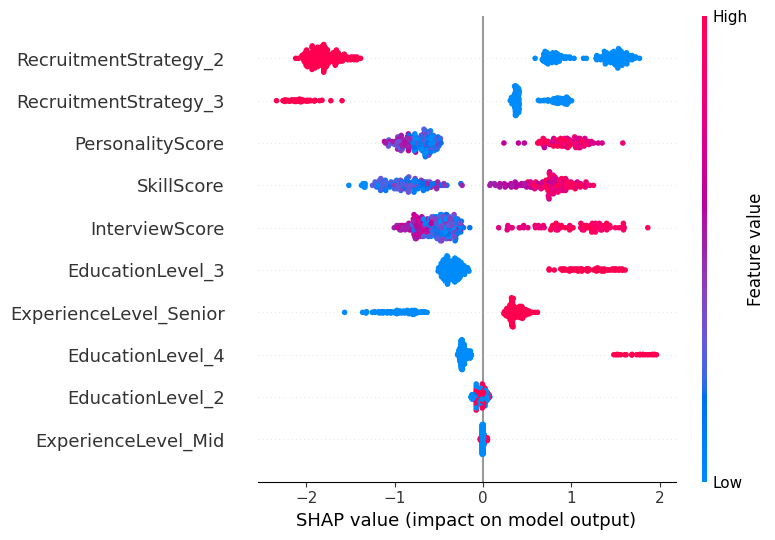

[](https://github.com/4Kings-Rakamin/Stage_3_BestModel_FeatureImportance)


# Stage 3 - Best Model & Feature Importance
This repository contains the best machine learning model for predicting hiring outcomes based on candidate data. The model is trained using various algoritm and includes feature importance analysis.


## Model Overview
Our recruitment prediction model uses XGBoost Classifier with the following characteristics:
- **Input Features**: Interview scores, skill assessments, personality evaluations, etc
- **Target Variable**: Hiring decision (Pass/Fail)
- **Best Performance**: 94.33% accuracy on test data
- **Key Advantage**: Lowest overfitting gap (1.08%) among tested models

## Model Performance
The model's performance is evaluated using various metrics such as accuracy, precision, recall, F1-score, and ROC-AUC. The following table summarizes the performance of various algoritm on both training and testing datasets:

| Model | Dataset | Accuracy | Precision | Recall | F1-Score | ROC-AUC |
|-------|---------|----------|-----------|---------|-----------|----------|
| Random Forest | Train | 0.965000 | 0.974138 | 0.911290 | 0.941667 | 0.998299 |
| Random Forest | Test | 0.920000 | 0.960000 | 0.774194 | 0.857143 | 0.935432 |
| Random Forest | Gap (%) | 4.500000 | 1.413793 | 13.709677 | 8.452381 | 6.286686 |
| Gradient Boosting | Train | 0.961667 | 0.963068 | 0.911290 | 0.936464 | 0.958096 |
| Gradient Boosting | Test | 0.936667 | 0.962500 | 0.827957 | 0.890173 | 0.933328 |
| Gradient Boosting | Gap (%) | 2.500000 | 0.056818 | 8.333333 | 4.629068 | 2.476819 |
| XGBoost | Train | 0.954167 | 0.962099 | 0.887097 | 0.923077 | 0.947201 |
| XGBoost | Test | 0.943333 | 0.963415 | 0.849462 | 0.902857 | 0.938393 |
| XGBoost | Gap (%) | 1.083333 | -0.131551 | 3.763441 | 2.021978 | 0.880798 |

## Model Comparison
Three models were evaluated:
1. **XGBoost** (Selected)
   - Highest test accuracy (94.33%)
   - Most stable performance (smallest gap)
   - Best balance of precision (96.34%) and recall (84.95%)

2. **Gradient Boosting**
   - Good performance but higher variance
   - Test accuracy: 93.67%

3. **Random Forest**
   - Shows signs of overfitting (4.5% accuracy gap)
   - Lowest test accuracy: 92%


## Usage
```````python
# Example code to load and use the model
import joblib

# Load the model
model = joblib.load('best_xgboost_model.joblib')

# Make predictions
predictions = model.predict(X)

```````

## Feature Importance
Feature importance analysis is performed to identify the most significant features contributing to the model's predictions. The analysis helps in understanding which features have the most impact on the hiring decision.

Using shap library, we can visualize the feature importance as follows:



## Local Setup
Clone the repository to your local machine using the following command:

```bash
git clone https://github.com/4Kings-Rakamin/Stage_3_BestModel_FeatureImportance.git

```


## Installation
To run the code in this repository, you need to have Python installed along with the required libraries. You can install the necessary libraries using pip:

```bash
pip install -r requirements.txt

```

